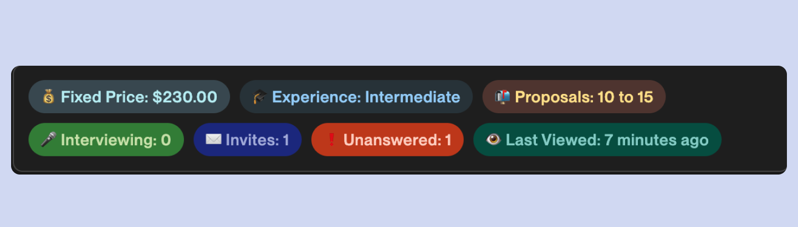
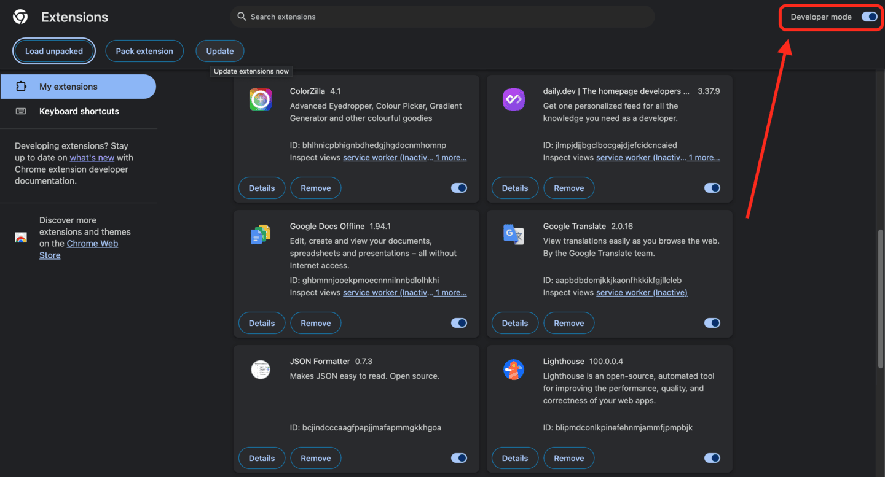
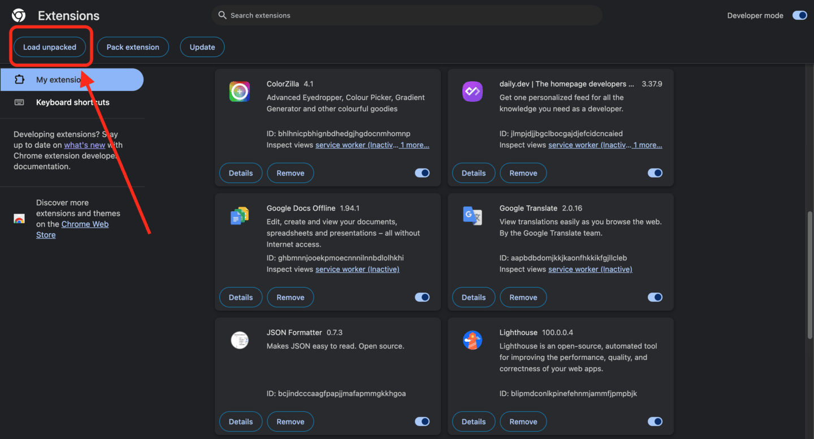
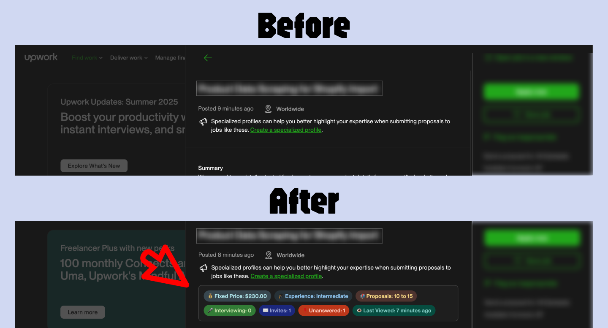

# Upwork Job Stats Extension

## 📋 What Problem Does This Solve?

When browsing jobs on Upwork, important information like **proposals count**, **client hiring history**, **budget**, and **project duration** is often buried at the bottom of long job descriptions. This means you have to scroll down every single job post to see crucial details that help you decide if a job is worth applying to.

**This extension solves that problem by extracting all the important stats and displaying them in a clean, organized box right at the top of each job card.**

## ✨ Key Features

- **📊 Quick Stats Overview**: See proposals, hires, budget, and duration without scrolling
- **🎯 Smart Highlighting**: Jobs with previous hires are highlighted with a subtle red background (these are often better opportunities!)
- **🌙 Theme Support**: Automatically adapts to Upwork's dark and light themes
- **🔄 Real-time Updates**: Works with Upwork's dynamic loading - no page refresh needed
- **📱 Clean Design**: Non-intrusive badges that match Upwork's design language

## 📊 What Information Is Displayed?

The extension shows these key stats in colorful badges:

- **💰 Budget**: Fixed price amount or hourly rate range
- **🎓 Experience Level**: Entry, Intermediate, or Expert level required
- **📅 Duration**: Project timeline (1-3 months, 3-6 months, etc.)
- **📬 Proposals**: How many freelancers have applied
- **🤝 Hires**: How many people the client has hired (🚨 **Jobs with hires are highlighted in red**)
- **🎤 Interviewing**: Current number of freelancers being interviewed
- **✉️ Invites Sent**: How many direct invites the client has sent
- **❗ Unanswered Invites**: Pending invitations
- **👁️ Last Viewed**: When the client last checked the job

## 📥 Download

  
### [⬇️ Download Latest Version](https://github.com/kavishna/upwork-stats-extension/releases/latest/download/upwork-stats-extension.zip)

_Click the button above to download the latest version_

## 🚀 Installation Guide

### Step 1: Download the Extension

1. Click the download button above to get the latest ZIP file
2. Extract the ZIP file to a folder on your computer (remember this location!)

### Step 2: Enable Developer Mode in Chrome

1. Open **Google Chrome**
2. Type `chrome://extensions/` in the address bar and press Enter
3. In the top-right corner, toggle **"Developer mode"** to ON
   

### Step 3: Load the Extension

1. Click the **"Load unpacked"** button that appears after enabling Developer mode
   
2. Navigate to the folder where you extracted the ZIP file
3. Select the folder and click **"Select Folder"**
4. The extension should now appear in your extensions list

### Step 4: Verify Installation

1. Go to [Upwork.com](https://upwork.com) and browse some job listings
2. You should see colorful stat badges appearing on job cards
3. Jobs with previous hires will have a subtle red highlight

## 🎨 Visual Examples

### Before (Default Upwork)

- Long job descriptions with stats hidden at the bottom
- Need to scroll through each job to see important details
- Hard to quickly compare opportunities

### After (With Extension)

- All key stats displayed prominently at the top
- Jobs with hires clearly highlighted
- Quick scanning of multiple opportunities

## 🔧 Technical Details

### Browser Compatibility

- **Google Chrome**: ✅ Fully supported
- **Microsoft Edge**: ✅ Fully supported (Chromium-based)
- **Firefox**: ❌ Not supported (uses different extension format)
- **Safari**: ❌ Not supported

### How It Works

- Uses content scripts to analyze Upwork's HTML structure
- Extracts data from existing elements (no API calls needed)
- Dynamically creates and styles stat badges
- Monitors page changes to handle Upwork's dynamic loading
- Respects Upwork's theme settings (dark/light mode)

### Privacy & Security

- **No data collection**: The extension only reads what's already on your screen
- **No external connections**: Works entirely offline once installed
- **No permissions required**: Doesn't access your personal information
- **Open source**: All code is readable and transparent

## 🔄 Updates

To update the extension:

1. Download the latest version
2. Extract to the same folder (overwrite old files)
3. Go to `chrome://extensions/`
4. Click the refresh button on the Upwork Stats Extension card

## ❓ Troubleshooting

### Extension Not Working?

1. **Refresh Upwork page**: Press F5 or Ctrl+R
2. **Check if enabled**: Go to `chrome://extensions/` and ensure the extension is turned ON
3. **Clear browser cache**: Sometimes cached files interfere with the extension

### Stats Not Showing?

1. Make sure you're on a job listing page (not profile or messages)
2. Wait a few seconds - some job cards load content dynamically
3. Try scrolling down and back up to trigger the detection

### Red Highlighting Not Working?

- Red highlighting only appears on jobs where the client has previously hired freelancers
- If no jobs show red highlighting, it means none of the current jobs have hire history

## 🆘 Support

If you encounter any issues:

1. Check the troubleshooting section above
2. Ensure you're using the latest version of Chrome
3. Try disabling other Upwork-related extensions temporarily
4. Create an issue on the GitHub repository with screenshots

## 📄 License

This project is licensed under the MIT License - see the [LICENSE](LICENSE) file for details.

This means you can freely use, modify, and distribute this extension!

---

**Happy freelancing! 🎉**
